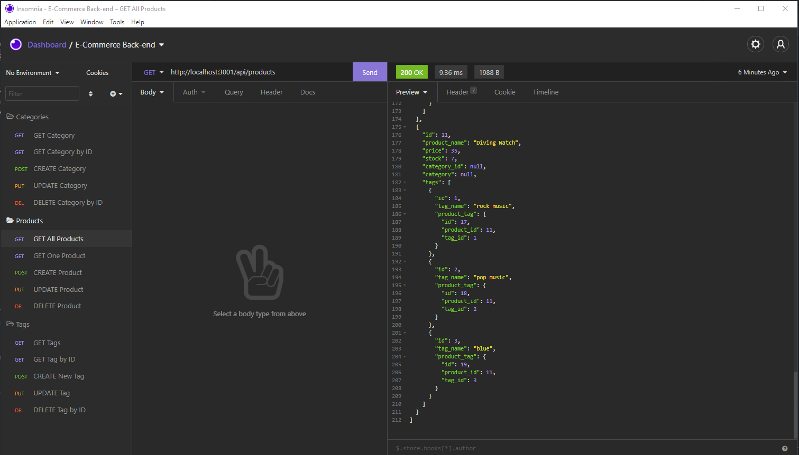

# ECommerce_Backend

## Description 

This application allows for creation and manipulation of a database for a hypothetical E-Commerce Store. It uses a table for Category, Product, and Tag, and a through table of ProductTag to link tables together. Through the pathing, CRUD operations are fully functional and Categories, Products, and Tags can be created, read, updated, destroyed. 

Here is a screenshot of the backend in Insomnia: 

Here is a link to the video of this project in action: [Test of Application]()

## Table of Contents

-- [Installation](#installation)

-- [Usage](#usage)

-- [License](#license)

-- [Contributing](#contributing)

-- [Tests](#tests)

-- [Questions](#questions)

## Installation
  
To install necessary dependencies, run the following command:

    npm i

Additionally, mySQL is required as a separate install. 

To set up database, run the following command in your mySQL shell:

    source db/schema.sql

Once that is done, exit the mySQL shell and run the following in order:

    node seeds/category-seeds.js
    node seeds/product-seeds.js
    node seeds/tag-seeds.js
    node seeds/product-tag-seeds.js

These will seed all four tables and populate the database. 

## Usage

Run the application with the following command:

    node server.js

Once the server is up and running, Insomnia can be used to make `GET`, `POST`, `PUT`, and `DELETE` requests. The main path for the server requests is `http://localhost:3001/api/`. Category paths end with `/categories`, Product with `/products`, and Tag with `/tags`. If searching for something with a specific id, the end of the path would be `/categories/:id`, `/products/:id`, and `/tags/:id`. 

## License

This project is protected under the [MIT](https://choosealicense.com/licenses/mit/) license. (2021) (Phil Bohn)

## Contributing

N/A

## Tests

N/A

## Questions

If there any questions regarding this project, I can be contacted in the following places:

GitHub: [@lamperouge1218](https://github.com/lamperouge1218)

Email: philbohn1791@gmail.com
